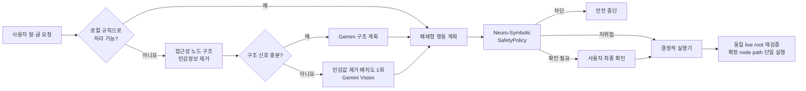

# 손주 (Sonju)

고령층이 스마트폰을 말과 큰 글씨로 쉽게 사용할 수 있도록 돕는 Android AI 접근성 프로토타입입니다. 원본 화면 이미지를 모델에 보내는 대신 Android 접근성 노드의 **버튼 이름·상태·위치 구조를 우선 사용**하고, 일부 의미 구조만 남은 저위험 화면에서는 민감값을 제거한 버튼 배치도로 Gemini Vision을 한 번 호출합니다.

## 지금 구현된 것

- 고령층 친화 홈 화면: 큰 글씨, 52–60dp 터치 영역, 명확한 연결 상태와 쉬운 예시
- 텍스트 및 한국어 음성 입력, 결과 TTS 안내
- 다른 앱 위에 표시되는 접근성 오버레이 `손` 버튼
- `AccessibilityNodeInfo` 기반 화면 구조 수집과 민감 필드 선제 마스킹
- Gemini Interactions API `v1`, `gemini-3.1-flash-lite`, JSON Schema 구조화 출력
- 의미 신호가 1–3개만 있고 위험·민감 문맥이 없는 화면에서만 원본 픽셀 없이 의미 노드 위치를 그린 480px 배치도를 Vision 입력
- 흔한 저위험 명령은 Gemini를 호출하지 않는 로컬 규칙 처리
- Neuro-Symbolic 안전 정책: Gemini 계획과 별개인 순수 규칙 엔진이 최종 허용·확인·차단 결정
- 확인 후 실행 직전에 패키지·창·전체 의미 트리 fingerprint를 다시 대조하고, 화면이 달라졌으면 fail-closed
- 최대 2,000개 노드를 안전 검사하고 더 큰/깊은 트리는 모델 전송과 조작을 모두 중단
- 버튼 클릭은 손주가 직접 연 공식 Settings Intent의 `경로 + Activity + 저위험 화면 + 허용 토글 이름 + Settings 소유 switch ID`가 모두 맞을 때만 허용하고, 외부 화면 글자 입력과 다른 클릭은 기본 차단
- 클릭 가능한 행 안의 스위치 자식과 custom state description까지 읽어 현재 상태와 명시된 최종 상태가 다를 때만 토글
- 서로 독립된 스크롤 영역이 하나일 때만 가장 안쪽의 의미 노드를 스크롤하고 좌표 스와이프는 사용하지 않음
- 매 동작 직전 하나의 동일한 live root에서 패키지·창·fingerprint를 다시 검증하고, 정책이 확정한 정확한 node path만 실행하며 대상이 달라지면 fail-closed
- 자동 재시도 없음, 화면을 바꾸는 실제 행동 1단계·전체 계획 최대 8항목·45초 제한, 서비스 중단 시 즉시 취소
- 앱 백업과 평문 HTTP 비활성화, Gemini Interactions 상태 저장 `store=false` 요청
- 로컬 계획·안전 정책 단위 테스트

지원하는 폐쇄형 동작은 기기에 설치된 앱 이름을 정확히 확인해 열기, 와이파이/소리/접근성/디스플레이/날짜·시간 설정 열기, 카메라·다이얼러·문자 작성 화면 열기, Android 설정의 검토된 저위험 스위치 상태 변경, 의미 노드 스크롤, 뒤로/홈/알림/빠른 설정입니다. 설정 토글은 손주가 해당 공식 설정 경로를 직접 연 뒤 첫 화면을 벗어나지 않았고, 경로별 Activity·제목·토글 이름·시스템 switch ID·현재 상태까지 양성 목록에 일치해야 합니다. 창 제목만으로는 신뢰하지 않습니다. 개발자 옵션·VPN·앱별 알림/관리 화면·자격 증명·권한 등 미분류 또는 위험 화면, 임의 버튼 클릭, 외부 화면 글자 입력은 기본 차단합니다. 다른 앱은 열기·뒤로 가기 같은 폐쇄형 전역 동작만 지원합니다.

송금·결제·구매·투자, 비밀번호/PIN/OTP/인증번호, 권한 승인, 앱 설치·삭제, 계정 삭제, 보안 해제, 공장 초기화, 외부 화면 글자 입력은 코드 수준에서 차단합니다. 메시지·전화와 모든 AI 생성 계획은 사용자 확인을 거칩니다.

## 동작 구조



핵심은 모델이 휴대폰을 직접 조작하지 않는다는 점입니다. Gemini는 허용된 enum과 JSON Schema 안에서 계획만 제안합니다. `SafetyPolicy`가 모델의 위험 판단을 신뢰하지 않고 다시 검사한 뒤, `SonjuAccessibilityService`가 현재 화면에서 정확히 하나로 식별된 노드에만 행동합니다.

## 실행 방법

요구 환경은 Android Studio의 JBR 21, Android SDK 36.1, Android 9(API 28) 이상 기기입니다.

```powershell
$env:JAVA_HOME='C:\Program Files\Android\Android Studio\jbr'
$env:Path="$env:JAVA_HOME\bin;$env:Path"
.\gradlew.bat :app:assembleDebug
```

API 키는 Git에서 제외된 `local.properties`에 둡니다.

```properties
GEMINI_API_KEY=YOUR_LOCAL_PROTOTYPE_KEY
```

1. APK를 설치하고 손주를 엽니다.
2. 개인정보 고지를 읽고 `동의하고 연결하기`를 누릅니다.
3. Android 접근성 설정에서 `손주 화면 도우미`를 직접 켭니다.
4. 다른 앱으로 이동하면 화면 오른쪽의 초록색 `손` 버튼이 표시됩니다.
5. 버튼을 누르고 요청을 말하거나 입력합니다.
6. AI 계획 또는 되돌리기 어려운 동작은 확인 화면을 읽고 직접 승인합니다.
7. `손` 버튼을 길게 누르면 진행 중 실행을 즉시 중단합니다.

단위 테스트:

```powershell
.\gradlew.bat :app:testDebugUnitTest
```

현재 저장소 상위 경로에 한글이 포함되어 있어 Windows의 Kotlin/Gradle 테스트 워커가 간헐적으로 클래스를 찾지 못할 수 있습니다. 이 경우 소스 문제가 아니라 [Android Gradle Plugin의 비 ASCII Windows 경로 제약](https://issuetracker.google.com/issues/37145273)이므로 `C:\src\sonju`처럼 ASCII 경로의 체크아웃에서 테스트하십시오. APK 빌드를 위한 경로 검사 우회는 `gradle.properties`에 포함되어 있습니다.

## ‘Google Framer’와 실제 구현 차이

Google의 공식 모바일 UI 기술 중 `Google Framer`라는 공개 API는 확인되지 않습니다. 화면을 보고 조작하는 에이전트를 뜻했다면 가장 가까운 공식 기능은 [Gemini Computer Use](https://ai.google.dev/gemini-api/docs/computer-use)이며, 화면 구조를 앱 렌더링 단계에서 가로채는 공개 Android API는 아닙니다.

이 프로토타입은 Android가 공식 제공하는 [AccessibilityService](https://developer.android.com/reference/android/accessibilityservice/AccessibilityService)의 의미 트리를 사용합니다. 따라서 매 프레임 VLM을 호출하는 방식보다 빠르고 저렴하지만 다음 화면은 완전히 파악하거나 조작할 수 없습니다.

- `FLAG_SECURE`가 설정된 금융·DRM·보안 창
- 접근성 의미 정보를 노출하지 않는 Canvas, 게임, 일부 WebView/SurfaceView
- 시스템 보안 경계, 잠금 화면, 생체 인증, 권한 승인 화면
- 서로 같은 이름을 가진 여러 버튼처럼 대상을 하나로 확정할 수 없는 화면
- 2,000개 노드 또는 깊이 24를 넘어 전체 안전 검사를 완료하지 못한 화면
- 저위험 화면·토글 이름·Settings switch ID 허용목록에 모두 일치하지 않는 클릭과 모든 외부 화면 글자 입력

이 경우 손주는 추측해서 좌표를 누르지 않고 중단합니다. 이 빌드는 Canvas·WebView 픽셀에 숨어 있을 수 있는 민감 정보가 유출되지 않도록 Android 원본 스크린샷을 만들거나 전송하지 않습니다.
Vision 입력은 이미 마스킹한 의미 노드의 공간 배치도일 뿐 좌표 클릭 권한을 만들지 않습니다. 실행 직전에 의미 트리와 민감 문맥을 다시 확인할 수 없는 화면에서는 스크롤·클릭·입력을 중단합니다. 특히 스크롤도 좌표 제스처가 아니라 현재 화면에서 유일하게 확인된 `scrollable` 의미 노드에만 요청합니다.

## 프로토타입과 출시 버전의 경계

현재 Gemini 키는 로컬 프로토타입을 빠르게 검증하기 위해 **debug APK의** `BuildConfig`로 들어가므로 APK에서 추출될 수 있습니다. release 빌드에는 빈 값만 들어가지만, 외부 배포 전에는 현재 키를 교체하고 클라이언트 직접 호출 자체를 제거해야 합니다. 출시 구조는 [Firebase AI Logic + App Check](https://firebase.google.com/docs/ai-logic/get-started?platform=android) 또는 서버 프록시에서 Gemini를 호출하는 방식이 필요합니다. Google도 [모바일 앱에 Gemini API 키를 직접 넣지 않도록 안내](https://ai.google.dev/gemini-api/docs/api-key)합니다.

Google Play는 일반 앱이 Accessibility API로 자율적으로 작업을 시작·계획·실행하는 것을 금지하고, 좁고 사람이 정의한 결정적 자동화만 별도로 허용합니다. 검증된 장애인용 접근성 도구는 핵심 목적 범위에서 예외가 있을 수 있지만 선언과 심사가 필요합니다. 이 프로토타입은 `isAccessibilityTool=false`, 별도 고지·동의, 사용자 시작, AI 계획 승인, 위험 작업 차단으로 구성했지만 **현재 AI 계획→접근성 실행 빌드는 그대로 Google Play에 배포할 수 없습니다.** Play 제출판은 AI를 안내 전용으로 제한해 실행을 사람이 정의한 결정적 규칙으로 좁히거나, 실제 장애 지원 핵심 목적과 기능을 입증해 별도 심사를 받아야 합니다. 자세한 기준은 [AccessibilityService 정책](https://support.google.com/googleplay/android-developer/answer/10964491)을 따르십시오.

더 자세한 안전 계약은 [docs/SAFETY_CONTRACT.md](docs/SAFETY_CONTRACT.md), 다음 작업을 위한 검증·배포 인수인계는 [docs/KNOWN_ISSUES.md](docs/KNOWN_ISSUES.md)를 참고하십시오.
