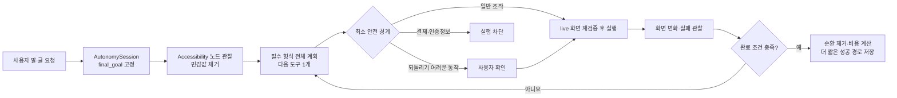

# 손주 (Sonju)

고령층이 말이나 글로 최종 목표를 설명하면, SonjuAI가 계획을 세우고 Android 앱을 직접 탐색하는 접근성 기반 자율 조작 프로토타입입니다. 특정 앱용 시나리오 대신 `AccessibilityService`가 제공하는 의미 노드와 범용 도구를 우선 사용하며, 각 동작 뒤 화면을 다시 관찰해 계획을 수정합니다.

최근 학습·재사용·실패 복구 변경과 검증 범위는 [AppSkill 구현·검증 기록](docs/APP_SKILL_VALIDATION.md)에 정리했습니다.

2026-09-21의 결과 문장 재사용, 한국어 입력 경계, 스크롤 대상 보존, 웹 관찰 및 실기기 복구·AI 호출 0회 검증은 [최신 AppSkill 검증 기록](docs/APP_SKILL_LIFECYCLE_20260921.md)에 정리했습니다.

> **현재 개발 빌드:** 일반 탐색은 자동 실행합니다. 택시 호출·주문 확정·메시지 전송처럼 되돌리기 어려운 동작은 실행 직전에 사용자 확인을 요구합니다. 결제·송금·비밀번호·OTP·인증정보 입력과 민감 화면 좌표 탭은 자동 실행하지 않습니다. 이 빌드는 실기기·OpenAI 운영 검증과 Play 정책 검토 전의 프로토타입입니다.

## 지금 구현된 것

- 고령층 친화 홈 화면: 큰 글씨, 52–60dp 터치 영역, 명확한 연결 상태와 쉬운 예시
- 텍스트 및 한국어 음성 입력, 결과 TTS 안내
- 사용자가 직접 켜고 끌 수 있는 기기 내 “손주야” 호출 감지와 마이크 foreground 알림
- 접근성 서비스가 연결된 동안 화면 오른쪽에 표시되는 빠른 음성 버튼과 하단 음성 패널
- 다른 앱에서 받은 명령은 손주 Activity를 열지 않고 접근성 서비스 안에서 계획·안전 검사·실행하며 필요한 확인도 하단 오버레이에 표시
- `손주야 + 명령` 백그라운드 호출
- `AccessibilityNodeInfo`의 text·description·hint·pane·state·focus·heading·지원 action·화면 좌표를 수집하고 민감값은 모델 입력 전에 제거
- OpenAI Responses API `v1`, 기본 `gpt-5.6-luna`, `reasoning.effort=none`, `store=false`, strict JSON Schema 구조화 계획
- 모든 AI 계획에 고정 `final_goal`, 실행 앱, 목표 페이지/기능, 전체 도구 집합, 전략, 관찰 가능한 완료 조건, 수정 이유를 필수 포함
- 실제 실행은 한 번에 한 도구만 수행한 뒤 새 화면을 관찰하는 `관찰 → 계획 → 도구 → 검증 → 재계획` 루프
- `ScreenState` semantic parser·stable fingerprint, canonical task, parameterized `AppSkill`과 모델 호출 없는 local fast path
- verifier가 현재 revision·fingerprint·유일한 node id에 묶어 발급한 `VerifiedPlan`만 실행하는 권한 경계
- event 기반 postcondition, 최종 goal evaluator, redacted process log와 유한 loop/timeout/cancellation 정책
- 범용 도구: 앱 열기, 접근성 요소 클릭, 0~1 정규화 좌표 클릭, 텍스트 입력, 상·하·좌·우 스크롤, 뒤로, 홈, 알림, 빠른 설정, 대기
- 접근성 action을 우선하고 좌표 gesture는 노드로 표현되지 않는 안전한 Canvas/WebView 화면의 폴백으로만 사용
- 접근성 대상은 selector 점수와 유일성을 검증하고, 편집 필드는 하나로 식별된 live node에만 `ACTION_SET_TEXT` 실행
- 같은 화면에서 같은 도구가 두 번 실패하면 다음 모델 문맥에 금지 후보로 넣어 selector·도구·경로 변경 유도
- 세션당 최대 60개 도구·40개 모델 호출·10분(사용자 인증 대기 제외), 동작별 live package/window/revision 재검증, 사용자 중단 즉시 취소
- 성공 경로의 화면 순환과 불필요한 대기를 제거하고 도구별 비용을 반영한 더 짧은 경로만 기기 로컬에 최대 80개·90일 보관
- 학습 경로에는 텍스트 입력값·스크린샷·원본 명령·화면 본문을 저장하지 않고 도구·안정 selector·정규화 좌표만 저장
- 개인정보로 표시된 화면은 원본 스크린샷을 원격 모델에 보내지 않음
- 새 작업은 AI가 계획하고, 검증된 AppSkill이 맞으면 AI 없이 재사용. 다른 표현은 AI가 저장 경로를 선택할 수 있으며 완료 후 해당 표현도 로컬에 학습
- 재사용 입력은 이번 요청에서 추출하며 요청의 고정 부분은 해시로 저장. 이전 입력값·결과를 새 요청의 성공 근거로 쓰지 않음
- 실행 전 실패는 새 관찰에서 한 번 재시도하고 반복 실패·화면 변경·실행 결과 불확실성은 해당 지점부터 AI가 복구. 완료가 검증된 뒤 기존 AppSkill 버전을 갱신
- 일반 http/https 웹 탐색도 공통 도구로 지원. 주소창의 출처 확인과 최종 결과 검증은 별도로 수행
- 저장 스킬이 없는 요청도 본문을 보존한 화면 관찰, 검증된 검색 제출, 반복 실패 피드백과 제한된 시각 재계획으로 처리하며 [일반 명령 개선·검증 기록](docs/GENERAL_COMMAND_RELIABILITY.md)에 근거를 정리
- 과거의 배민 전용 결정적 경로는 호환 코드로만 남아 있고 기본 명령 파이프라인에서는 사용하지 않음
- 앱 백업과 평문 HTTP 비활성화, OpenAI Responses 상태 저장 `store=false` 요청
- 계획 불변성·반복 실패·경로 최적화·최소 안전 정책·selector 유일성 회귀 테스트

일반 앱 탐색과 비민감 정보 입력은 기본 허용입니다. 되돌리기 어려운 high-risk 동작은 직전 확인을 거치며, critical final commit과 민감 입력은 차단합니다. 잘못된 좌표, 비어 있는 입력값, 여러 편집 필드 중 대상을 확정하지 못한 경우, 관찰하지 않은 미래 화면 행동을 한 번에 묶은 계획도 실행하지 않고 새 계획을 요청합니다.

## 동작 구조



모델은 도구를 직접 호출하지 않고 구조화된 다음 도구를 제안합니다. 로컬 세션이 최종 목표를 덮어쓰지 못하게 고정하고, speculative batch를 한 단계로 줄이며, live 화면과 도구 인자를 검증한 뒤 `SonjuAccessibilityService`가 실행합니다. 기준 문서는 [새 아키텍처 계약](docs/sonju-agent-architecture.md), [구현 아키텍처](docs/architecture.md), [verifier 계약](docs/safety-verifier.md)입니다.

## 실행 방법

요구 환경은 Android Studio의 JBR 21, Android SDK 36.1, Android 9(API 28) 이상 기기입니다.

```powershell
$env:JAVA_HOME='C:\Program Files\Android\Android Studio\jbr'
$env:Path="$env:JAVA_HOME\bin;$env:Path"
.\gradlew.bat :app:assembleDebug
```

API 키는 Git에서 제외된 `local.properties`에 둡니다.

```properties
OPENAI_API_KEY=YOUR_LOCAL_PROTOTYPE_KEY
OPENAI_MODEL=gpt-5.6-luna
```

`OPENAI_MODEL`은 선택 항목이며 기본값은 이미지 입력과 [Structured Outputs](https://developers.openai.com/api/docs/guides/structured-outputs)를 지원하는 [`gpt-5.6-luna`](https://developers.openai.com/api/docs/models/gpt-5.6-luna)입니다. 기존 저지연 기준을 유지하도록 요청에는 `reasoning.effort=none`을 명시합니다. 실제 키가 없는 상태에서도 단위 테스트와 빌드는 가능하지만 OpenAI 실 API 경로가 검증되었다는 뜻은 아닙니다. 실제 키나 키가 든 `local.properties`는 커밋하지 마십시오.

1. APK를 설치하고 손주를 엽니다.
2. 개인정보 고지를 읽고 `동의하고 연결하기`를 누릅니다.
3. Android 13 이상에서 `보안을 위해 이 설정을 사용할 수 없음` 또는 `제한된 설정`이 표시되면, 손주가 여는 앱 정보 화면의 오른쪽 위 `⋮`에서 `제한된 설정 허용`을 누릅니다. 이 메뉴가 없으면 이 단계는 건너뜁니다.
4. 손주로 돌아와 `연결하기`를 다시 누른 뒤 Android 접근성 설정에서 `손주 화면 도우미`를 직접 켭니다.
   - `개인정보 또는 금융정보가 위험할 수 있음`이라는 확인은 금융 권한 요청이 아니라, 화면 내용을 읽을 수 있는 모든 접근성 서비스에 Android가 표시하는 시스템 경고입니다. 설명을 확인한 뒤 사용자가 직접 허용해야 합니다.
   - 스위치 자체가 비활성화되거나 허용이 거부되면 삼성 `설정 → 보안 및 개인정보 보호 → 자동 차단` 또는 Google 계정의 `고급 보호`가 외부 APK의 접근성 서비스를 제한하는지 확인합니다.
5. 다른 앱에서 화면 오른쪽의 마이크 버튼을 누르면 하단 음성 패널이 열립니다. 또는 홈에서 `백그라운드 호출 켜기`를 켠 뒤 `손주야, 와이파이 설정 열어 줘`처럼 말합니다.
6. 하단 패널에 요청을 말하면 버튼을 한 번 더 누르지 않아도 자동으로 시작합니다.
7. 택시 호출·주문 확정·메시지 전송처럼 되돌리기 어려운 동작은 현재 앱 위의 하단 확인 패널에서 직접 승인합니다. 결제·송금·비밀번호·OTP 입력은 승인 여부와 관계없이 자동 실행하지 않습니다.
8. 진행을 중단하려면 손주 앱이나 지속 알림의 `끄기`를 누릅니다.

### “손주야” 백그라운드 호출

1. 화면 도우미를 먼저 연결합니다.
2. 홈의 `백그라운드 호출 켜기`를 누르고 상시 마이크 사용 안내를 확인합니다.
3. 마이크와 알림 권한을 허용합니다.
4. 처음 켰다면 앱에 포함된 오프라인 한국어 모델을 준비할 때까지 기다립니다. 이후 지속 알림에 `손주가 “손주야”를 듣고 있어요`가 표시되면 다른 앱이나 홈 화면에서 `손주야`라고 부릅니다.
5. 빅스비처럼 화면 아래에 임시 음성 패널이 나타나면 `와이파이 설정 열어 줘` 또는 `배민 들어가서 피자 시켜줘`처럼 명령을 말합니다. 말하는 내용이 실시간으로 표시되고, 말이 끝나면 현재 화면 문맥과 함께 자동 실행됩니다.
6. 일부 기기에서 호출어와 명령이 한 문장으로 최종 인식된 경우에도 `손주에게 부탁하기` 버튼 없이 바로 시작합니다.

최초 1회 Android 마이크 권한과 접근성 서비스 허용은 사용자가 직접 승인해야 합니다. 한 번 허용하고 백그라운드 호출을 켜면 선택을 저장하며, 서비스가 정상적으로 종료된 뒤 앱을 다시 열었을 때 별도 켜기 버튼 없이 자동으로 복구합니다. 사용자가 `끄기`, 권한 철회 또는 강제 종료를 선택한 경우에는 자동으로 우회하거나 다시 켜지 않습니다.

주문·택시 호출·메시지 전송처럼 외부 영향이 생기는 마지막 단계는 음성 오인식만으로 확정하지 않고 사용자 확인을 유지합니다. 결제와 송금은 현재 제품 정책상 최종 단계 직전에서 멈춥니다.

호출 감지는 앱에 포함된 Vosk 한국어 오프라인 모델로 휴대폰 안에서 처리하며, 호출 대기 중인 음성을 서버로 보내지 않습니다. 모델 포함으로 APK와 설치 용량이 커지고 처음 켤 때 모델을 한 번 준비해야 하며, 상시 마이크 처리로 메모리와 배터리 사용량도 늘어납니다. 오프라인 모델 준비에 실패한 경우에만 Android 12(API 31) 이상의 시스템 기기 내 인식을 보조 수단으로 사용합니다. Android 정책에 따라 앱을 닫아도 마이크 foreground service 알림과 시스템 마이크 표시가 유지되며, 알림의 `끄기` 또는 앱의 `끄기` 버튼으로 즉시 종료할 수 있습니다. 제조사 절전 정책으로 서비스가 종료되면 앱을 다시 열 때 저장된 켜짐 상태를 복구합니다. 사용자의 강제 종료 뒤에는 Android가 앱 실행을 막으므로 앱을 직접 다시 열어야 하며, Android 14 이상에서는 재부팅 직후 마이크 서비스를 자동 시작할 수 없습니다.

`제한된 설정`은 외부 APK 설치 앱이 접근성 같은 민감 권한을 바로 얻지 못하게 하는 Android의 정상 보안 기능입니다. 앱이 이 보호 장치를 코드로 해제하거나 우회할 수는 없으며, 사용자가 앱 정보 화면에서 직접 허용해야 합니다.

단위 테스트:

```powershell
.\gradlew.bat :app:testDebugUnitTest
```

현재 저장소 상위 경로에 한글이 포함되어 있어 Windows의 Kotlin/Gradle 테스트 워커가 간헐적으로 클래스를 찾지 못할 수 있습니다. 이 경우 소스 문제가 아니라 [Android Gradle Plugin의 비 ASCII Windows 경로 제약](https://issuetracker.google.com/issues/37145273)이므로 `C:\src\sonju`처럼 ASCII 경로의 체크아웃에서 테스트하십시오. APK 빌드를 위한 경로 검사 우회는 `gradle.properties`에 포함되어 있습니다.

## USB ADB 기기 테스트

폰에서 개발자 옵션과 USB 디버깅을 켜고 USB 디버깅 허용 대화상자를 승인한 뒤 아래 스크립트를 실행하면 debug APK를 빌드·설치하고 Sonju를 시작합니다. 연결 절차와 다중 기기 선택은 [ADB 기기 테스트 문서](docs/ADB_DEVICE_TESTING.md)를 참고하십시오.

```powershell
.\scripts\adb-debug-install.ps1
```

## Android 접근성 구현 경계

이 프로토타입은 Android가 공식 제공하는 [AccessibilityService](https://developer.android.com/reference/android/accessibilityservice/AccessibilityService)의 의미 트리를 사용합니다. 따라서 매 프레임 VLM을 호출하는 방식보다 빠르고 저렴하지만 다음 화면은 완전히 파악하거나 조작할 수 없습니다.

- `FLAG_SECURE`가 설정된 금융·DRM·보안 창과 Android가 캡처를 거부하는 화면
- 잠금 화면·생체 인증 등 앱이 접근성 동작을 허용하지 않는 시스템 보안 경계
- 접근성 정보와 캡처 모두에 대상이 보이지 않는 SurfaceView·게임 화면
- 2,000개 노드 또는 깊이 24를 넘어 스냅샷이 잘린 화면에서 누락된 대상
- 제조사/OEM이 표준 accessibility action이나 gesture를 거부하는 화면

원본 화면은 접근성 노드로 목표를 찾지 못한 경우에만 Android 11 이상의 `takeScreenshot`으로 캡처합니다. 민감 노드가 하나라도 있는 화면은 원본 캡처를 모델에 보내지 않습니다. 안전한 화면에서 시각 모델이 찾은 좌표도 즉시 누르지 않고 `CLICK_COORDINATE` 계획으로 변환해 좌표 범위·live revision·최소 안전 정책을 거칩니다.

외부 앱 텍스트 입력은 유일한 editable node를 찾았을 때 `ACTION_FOCUS`와 `ACTION_SET_TEXT`로 수행합니다. 스크롤은 노드가 제공하는 방향 action을 먼저 사용하고, 사용할 수 없을 때 화면 중앙 gesture로 폴백합니다. 실행 결과가 실패하거나 화면이 바뀌면 최종 목표는 유지한 채 나머지 계획을 새로 만듭니다.

AppSkill은 실제 관찰된 성공 경로에서 불필요한 순환과 대기를 제거합니다. 입력·제출·상태 변경·사용자 인증 경계는 제거하지 않습니다. 정상 경로는 더 짧은 경로가 검증됐을 때, 실패 경로는 대체 경로의 완료가 검증됐을 때 갱신합니다. AppSkill은 최대 100개, 각 경로의 요청 표현은 최대 8개입니다. 별도의 과거 경로 힌트는 최대 80개·90일을 보관합니다. 입력값·원본 명령·스크린샷·화면 본문은 저장하지 않습니다. 상세 계약은 [AppSkill 형식](docs/skill-format.md)을 참고하십시오.

## 프로토타입과 출시 버전의 경계

현재 OpenAI 키는 로컬 프로토타입을 빠르게 검증하기 위해 **debug APK의** `BuildConfig`로 들어갈 수 있으므로 APK에서 추출될 수 있습니다. release 빌드에는 빈 값만 들어가지만, 외부 배포 전에는 현재 키를 교체하고 모바일 클라이언트 직접 호출 자체를 제거해야 합니다. 출시 구조는 서버 프록시나 보호된 모바일 AI 게이트웨이에서 OpenAI를 호출하고 앱에는 단기 사용자 세션만 제공해야 합니다.

Google Play는 일반 앱이 Accessibility API로 자율적으로 작업을 시작·계획·실행하는 것을 금지하고, 좁고 사람이 정의한 결정적 자동화만 별도로 허용합니다. 검증된 장애인용 접근성 도구는 핵심 목적 범위에서 예외가 있을 수 있지만 선언과 심사가 필요합니다. 이 프로토타입은 `isAccessibilityTool=false`, 별도 고지·동의, 사용자 시작, AI 계획 승인, 위험 작업 차단으로 구성했지만 **현재 AI 계획→접근성 실행 빌드는 그대로 Google Play에 배포할 수 없습니다.** Play 제출판은 AI를 안내 전용으로 제한해 실행을 사람이 정의한 결정적 규칙으로 좁히거나, 실제 장애 지원 핵심 목적과 기능을 입증해 별도 심사를 받아야 합니다. 자세한 기준은 [AccessibilityService 정책](https://support.google.com/googleplay/android-developer/answer/10964491)을 따르십시오.

더 자세한 안전 계약은 [docs/SAFETY_CONTRACT.md](docs/SAFETY_CONTRACT.md), 다음 작업을 위한 검증·배포 인수인계는 [docs/KNOWN_ISSUES.md](docs/KNOWN_ISSUES.md)를 참고하십시오.
