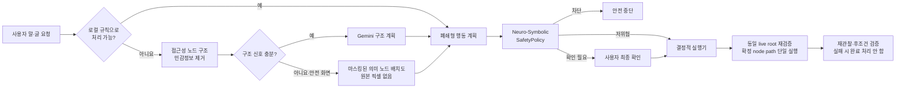

# 손주 (Sonju)

고령층이 스마트폰을 말과 큰 글씨로 쉽게 사용할 수 있도록 돕는 Android AI 접근성 프로토타입입니다. Android 접근성 노드의 **버튼 이름·상태·위치 구조만 실행 근거로 사용**합니다. 원본 화면은 캡처·전송하지 않으며, 구조 신호가 적은 저위험 화면도 민감값을 제거한 의미 노드 배치도만 Gemini의 보조 입력으로 사용합니다.

> **현재 테스트 구성:** 클릭 안전검사는 요청에 따라 코드에서 제거되어 있습니다. 클릭 계획은 사용자 확인, 명령·화면 위험도, 민감 화면, 중복 후보, 패키지·창·revision, 노드 상태와 실행 후 상태 변화를 검사하지 않고 현재 트리에서 처음 일치하는 clickable node에 `ACTION_CLICK`을 전달합니다. 배민 최종 주문 클릭 확인창도 제거되었습니다. 실제 계정·결제·권한 화면에서 사용하지 마십시오.

## 지금 구현된 것

- 고령층 친화 홈 화면: 큰 글씨, 52–60dp 터치 영역, 명확한 연결 상태와 쉬운 예시
- 텍스트 및 한국어 음성 입력, 결과 TTS 안내
- 사용자가 직접 켜고 끌 수 있는 기기 내 “손주야” 호출 감지와 마이크 foreground 알림
- 접근성 서비스가 연결된 동안 화면 오른쪽에 표시되는 빠른 음성 버튼과 하단 음성 패널
- 다른 앱에서 받은 명령은 손주 Activity를 열지 않고 접근성 서비스 안에서 계획·안전 검사·실행하며 필요한 확인도 하단 오버레이에 표시
- `손주야 + 명령` 백그라운드 호출
- `AccessibilityNodeInfo` 기반 화면 구조 수집과 민감 필드 선제 마스킹
- Gemini Interactions API `v1`, `gemini-3.1-flash-lite`, JSON Schema 구조화 출력
- 구조 신호가 적은 안전한 화면에서는 원본 픽셀 대신 마스킹된 노드 라벨·역할·경계만 그린 의미 배치도를 Gemini 보조 입력으로 사용
- AI 좌표 클릭은 지원하지 않으며, 모델 계획은 정확히 하나로 검증된 접근성 node path에만 사용자 확인 후 연결
- 흔한 저위험 명령은 Gemini를 호출하지 않는 로컬 규칙 처리
- 같은 명령·앱·의미 화면에서 성공한 저위험 단일 동작만 로컬 해시 키로 최대 40개 재사용하고 매번 안전 정책과 live node를 다시 검증
- Neuro-Symbolic 안전 정책: Gemini 계획과 별개인 순수 규칙 엔진이 최종 허용·확인·차단을 결정하며, 검토된 로컬 저위험 규칙만 추가 확인 없이 실행하고 모든 Gemini 계획은 확인 요구
- 손주 오버레이를 제외한 대상 앱 이벤트의 단조 revision과 패키지·창 ID·전체 의미 트리를 실행 직전에 다시 대조해 A→B→A 변화도 fail-closed
- 최대 2,000개 노드를 안전 검사하고 더 큰/깊은 트리는 모델 전송과 조작을 모두 중단
- 버튼 클릭은 손주가 직접 연 공식 Settings Intent의 `경로 + Activity + 저위험 화면 + 허용 토글 이름 + Settings 소유 switch ID`가 모두 맞을 때만 허용하고, 외부 화면 글자 입력과 다른 클릭은 기본 차단
- 배민 패키지 `com.sampleapp`에서만 동작하는 결정적 주문 보조: 검색어 입력, 첫 일치 결과, 기본 옵션, 장바구니 이동 후 주문·결제 버튼마다 사용자 최종 확인
- 클릭 가능한 행 안의 스위치 자식과 custom state description까지 읽어 현재 상태와 명시된 최종 상태가 다를 때만 토글
- 서로 독립된 스크롤 영역이 하나일 때만 가장 안쪽의 의미 노드를 스크롤하고 좌표 스와이프는 사용하지 않음
- 클릭은 검증된 의미 노드의 `ACTION_CLICK`만 사용하며 실패하면 중단; 좌표 제스처 권한과 fallback은 사용하지 않음
- 매 동작 직전 하나의 동일한 live root에서 패키지·창·revision을 다시 검증하고, 정책이 확정한 정확한 node path만 실행하며 대상이 달라지면 fail-closed
- 실제 행동은 자동 재시도하지 않고 실행 뒤 다시 관찰해 action별 목적 패키지·Settings 경로·구조 변화·요청한 토글 상태가 확인되어야 완료 처리; 1단계·전체 계획 최대 8항목·45초 제한
- 앱 백업과 평문 HTTP 비활성화, Gemini Interactions 상태 저장 `store=false` 요청
- 로컬 계획·안전 정책 단위 테스트

지원하는 폐쇄형 동작은 기기에 설치된 앱 이름을 정확히 확인해 열기, 와이파이/소리/접근성/디스플레이/날짜·시간 설정 열기, 카메라·다이얼러·문자 작성 화면 열기, Android 설정의 검토된 저위험 스위치 상태 변경, 의미 노드 스크롤, 뒤로/홈/알림/빠른 설정입니다. 추가로 배민 패키지 안에서만 검색어 입력·첫 일치 결과 선택·기본 옵션 유지·장바구니 이동을 정해진 규칙으로 지원합니다. 설정 토글은 손주가 해당 공식 설정 경로를 직접 연 뒤 첫 화면을 벗어나지 않았고, 경로별 Activity·제목·토글 이름·시스템 switch ID·현재 상태까지 양성 목록에 일치해야 합니다. 창 제목만으로는 신뢰하지 않습니다. 개발자 옵션·VPN·앱별 알림/관리 화면·자격 증명·권한 등 미분류 또는 위험 화면, 임의 버튼 클릭, 배민 검색란 이외의 외부 화면 글자 입력은 기본 차단합니다. 다른 앱은 열기·뒤로 가기 같은 폐쇄형 전역 동작만 지원합니다.

송금·투자, 비밀번호/PIN/OTP/인증번호/카드번호/생체인증, 권한 승인, 앱 설치·삭제, 계정 삭제, 보안 해제, 공장 초기화는 코드 수준에서 차단합니다. 배민 이외의 구매·결제와 배민 검색란 이외의 외부 화면 글자 입력도 차단합니다. 배민의 주문·결제 버튼은 현재 화면 revision과 fingerprint를 저장하고 주소·메뉴·수량·총액을 보여 준 뒤 사용자가 `내용 확인했고 주문 확정`을 직접 눌렀을 때만 동일 revision의 동일 노드를 한 번 누릅니다. 메시지·전화와 모든 AI 생성 계획은 사용자 확인을 거칩니다.

## 동작 구조



핵심은 모델이 휴대폰을 직접 조작하거나 성공을 확정하지 않는다는 점입니다. Gemini는 허용된 enum과 JSON Schema 안에서 계획과 완료 후보만 제안합니다. `SafetyPolicy`가 모델의 위험 판단을 신뢰하지 않고 다시 검사한 뒤, `SonjuAccessibilityService`가 현재 화면에서 정확히 하나로 식별된 노드에만 행동합니다. 모델의 `goal_completed`만으로는 “완료”를 표시하거나 성공 기억을 만들지 않습니다.

## 실행 방법

요구 환경은 Android Studio의 JBR 21, Android SDK 36.1, Android 9(API 28) 이상 기기입니다.

```powershell
$env:JAVA_HOME='C:\Program Files\Android\Android Studio\jbr'
$env:Path="$env:JAVA_HOME\bin;$env:Path"
.\gradlew.bat :app:assembleDebug
```

API 키는 Git에서 제외된 `local.properties`에 둡니다.

```properties
GEMINI_API_KEY=YOUR_LOCAL_PROTOTYPE_KEY
```

1. APK를 설치하고 손주를 엽니다.
2. 개인정보 고지를 읽고 `동의하고 연결하기`를 누릅니다.
3. Android 13 이상에서 `보안을 위해 이 설정을 사용할 수 없음` 또는 `제한된 설정`이 표시되면, 손주가 여는 앱 정보 화면의 오른쪽 위 `⋮`에서 `제한된 설정 허용`을 누릅니다. 이 메뉴가 없으면 이 단계는 건너뜁니다.
4. 손주로 돌아와 `연결하기`를 다시 누른 뒤 Android 접근성 설정에서 `손주 화면 도우미`를 직접 켭니다.
   - `개인정보 또는 금융정보가 위험할 수 있음`이라는 확인은 금융 권한 요청이 아니라, 화면 내용을 읽을 수 있는 모든 접근성 서비스에 Android가 표시하는 시스템 경고입니다. 설명을 확인한 뒤 사용자가 직접 허용해야 합니다.
   - 스위치 자체가 비활성화되거나 허용이 거부되면 삼성 `설정 → 보안 및 개인정보 보호 → 자동 차단` 또는 Google 계정의 `고급 보호`가 외부 APK의 접근성 서비스를 제한하는지 확인합니다.
5. 다른 앱에서 화면 오른쪽의 마이크 버튼을 누르면 하단 음성 패널이 열립니다. 또는 홈에서 `백그라운드 호출 켜기`를 켠 뒤 `손주야, 와이파이 설정 열어 줘`처럼 말합니다.
6. 하단 패널에 요청을 말하면 버튼을 한 번 더 누르지 않아도 자동으로 시작합니다.
7. AI 계획 또는 되돌리기 어려운 동작은 현재 앱 위의 하단 확인 패널을 읽고 직접 승인합니다.
8. 진행을 중단하려면 손주 앱이나 지속 알림의 `끄기`를 누릅니다.

### “손주야” 백그라운드 호출

1. 화면 도우미를 먼저 연결합니다.
2. 홈의 `백그라운드 호출 켜기`를 누르고 상시 마이크 사용 안내를 확인합니다.
3. 마이크와 알림 권한을 허용합니다.
4. 처음 켰다면 앱에 포함된 오프라인 한국어 모델을 준비할 때까지 기다립니다. 이후 지속 알림에 `손주가 “손주야”를 듣고 있어요`가 표시되면 다른 앱이나 홈 화면에서 `손주야`라고 부릅니다.
5. 빅스비처럼 화면 아래에 임시 음성 패널이 나타나면 `와이파이 설정 열어 줘` 또는 `배민 들어가서 피자 시켜줘`처럼 명령을 말합니다. 말하는 내용이 실시간으로 표시되고, 말이 끝나면 현재 화면 문맥과 함께 자동 실행됩니다.
6. 일부 기기에서 호출어와 명령이 한 문장으로 최종 인식된 경우에도 `손주에게 부탁하기` 버튼 없이 바로 시작합니다.

최초 1회 Android 마이크 권한과 접근성 서비스 허용은 사용자가 직접 승인해야 합니다. 한 번 허용하고 백그라운드 호출을 켜면 선택을 저장하며, 서비스가 정상적으로 종료된 뒤 앱을 다시 열었을 때 별도 켜기 버튼 없이 자동으로 복구합니다. 사용자가 `끄기`, 권한 철회 또는 강제 종료를 선택한 경우에는 자동으로 우회하거나 다시 켜지 않습니다.

주문·결제·메시지 전송처럼 비용이나 외부 영향이 생기는 마지막 단계는 음성 오인식만으로 확정하지 않으며 기존 사용자 확인을 유지합니다.

호출 감지는 앱에 포함된 Vosk 한국어 오프라인 모델로 휴대폰 안에서 처리하며, 호출 대기 중인 음성을 서버로 보내지 않습니다. 모델 포함으로 APK와 설치 용량이 커지고 처음 켤 때 모델을 한 번 준비해야 하며, 상시 마이크 처리로 메모리와 배터리 사용량도 늘어납니다. 오프라인 모델 준비에 실패한 경우에만 Android 12(API 31) 이상의 시스템 기기 내 인식을 보조 수단으로 사용합니다. Android 정책에 따라 앱을 닫아도 마이크 foreground service 알림과 시스템 마이크 표시가 유지되며, 알림의 `끄기` 또는 앱의 `끄기` 버튼으로 즉시 종료할 수 있습니다. 제조사 절전 정책으로 서비스가 종료되면 앱을 다시 열 때 저장된 켜짐 상태를 복구합니다. 사용자의 강제 종료 뒤에는 Android가 앱 실행을 막으므로 앱을 직접 다시 열어야 하며, Android 14 이상에서는 재부팅 직후 마이크 서비스를 자동 시작할 수 없습니다.

`제한된 설정`은 외부 APK 설치 앱이 접근성 같은 민감 권한을 바로 얻지 못하게 하는 Android의 정상 보안 기능입니다. 앱이 이 보호 장치를 코드로 해제하거나 우회할 수는 없으며, 사용자가 앱 정보 화면에서 직접 허용해야 합니다.

단위 테스트:

```powershell
.\gradlew.bat :app:testDebugUnitTest
```

현재 저장소 상위 경로에 한글이 포함되어 있어 Windows의 Kotlin/Gradle 테스트 워커가 간헐적으로 클래스를 찾지 못할 수 있습니다. 이 경우 소스 문제가 아니라 [Android Gradle Plugin의 비 ASCII Windows 경로 제약](https://issuetracker.google.com/issues/37145273)이므로 `C:\src\sonju`처럼 ASCII 경로의 체크아웃에서 테스트하십시오. APK 빌드를 위한 경로 검사 우회는 `gradle.properties`에 포함되어 있습니다.

## ‘Google Framer’와 실제 구현 차이

Google의 공식 모바일 UI 기술 중 `Google Framer`라는 공개 API는 확인되지 않습니다. 화면을 보고 조작하는 에이전트를 뜻했다면 가장 가까운 공식 기능은 [Gemini Computer Use](https://ai.google.dev/gemini-api/docs/computer-use)이며, 화면 구조를 앱 렌더링 단계에서 가로채는 공개 Android API는 아닙니다.

이 프로토타입은 Android가 공식 제공하는 [AccessibilityService](https://developer.android.com/reference/android/accessibilityservice/AccessibilityService)의 의미 트리를 사용합니다. 따라서 매 프레임 VLM을 호출하는 방식보다 빠르고 저렴하지만 다음 화면은 완전히 파악하거나 조작할 수 없습니다.

- `FLAG_SECURE`가 설정된 금융·DRM·보안 창
- 접근성 의미 정보를 노출하지 않는 Canvas, 게임, 일부 WebView/SurfaceView
- 시스템 보안 경계, 잠금 화면, 생체 인증, 권한 승인 화면
- 서로 같은 이름을 가진 여러 버튼처럼 대상을 하나로 확정할 수 없는 화면
- 2,000개 노드 또는 깊이 24를 넘어 전체 안전 검사를 완료하지 못한 화면
- 저위험 화면·토글 이름·Settings switch ID 허용목록에 모두 일치하지 않는 클릭과 모든 외부 화면 글자 입력

원본 화면 캡처 권한과 픽셀 전송 경로는 제거했습니다. 구조 신호가 적더라도 전체 트리 검사가 끝난 저위험 화면에서만 이미 마스킹한 의미 노드의 라벨·역할·경계를 새 배치도에 그려 요청 메모리에서 사용합니다. 금융·결제·인증·권한·설치·민감 입력 신호 또는 잘린 트리가 있으면 이 배치도도 만들거나 전송하지 않습니다.
Gemini가 좌표를 반환하는 schema와 좌표 실행 경로는 없습니다. 실행 직전 같은 창 ID와 전체 의미 revision에서 실제 접근성 클릭 노드가 정확히 하나로 다시 검증될 때만 사용자 확인 후 `ACTION_CLICK`을 한 번 요청합니다. `ACTION_CLICK`이 실패하면 좌표 탭으로 우회하지 않고 중단하며, 실행 결과는 화면 재관찰로 확인합니다. 외부 화면 글자 입력과 좌표 스와이프는 계속 차단합니다.

Gemini 구조 계획으로 성공한 저위험 단일 화면 동작은 같은 명령 해시·패키지·의미 화면 해시에서만 로컬 재사용합니다. 원본 명령, 화면 이미지, 전체 화면 구조는 저장하지 않고 클릭 대상 이름·목표 상태처럼 재실행에 필요한 최소 동작만 최대 40개·30일 동안 보관합니다. 재사용 계획도 현재 화면의 revision과 안전 정책을 처음부터 다시 검증하고 사용자 확인을 요구합니다.

## 프로토타입과 출시 버전의 경계

현재 Gemini 키는 로컬 프로토타입을 빠르게 검증하기 위해 **debug APK의** `BuildConfig`로 들어가므로 APK에서 추출될 수 있습니다. release 빌드에는 빈 값만 들어가지만, 외부 배포 전에는 현재 키를 교체하고 클라이언트 직접 호출 자체를 제거해야 합니다. 출시 구조는 [Firebase AI Logic + App Check](https://firebase.google.com/docs/ai-logic/get-started?platform=android) 또는 서버 프록시에서 Gemini를 호출하는 방식이 필요합니다. Google도 [모바일 앱에 Gemini API 키를 직접 넣지 않도록 안내](https://ai.google.dev/gemini-api/docs/api-key)합니다.

Google Play는 일반 앱이 Accessibility API로 자율적으로 작업을 시작·계획·실행하는 것을 금지하고, 좁고 사람이 정의한 결정적 자동화만 별도로 허용합니다. 검증된 장애인용 접근성 도구는 핵심 목적 범위에서 예외가 있을 수 있지만 선언과 심사가 필요합니다. 이 프로토타입은 `isAccessibilityTool=false`, 별도 고지·동의, 사용자 시작, AI 계획 승인, 위험 작업 차단으로 구성했지만 **현재 AI 계획→접근성 실행 빌드는 그대로 Google Play에 배포할 수 없습니다.** Play 제출판은 AI를 안내 전용으로 제한해 실행을 사람이 정의한 결정적 규칙으로 좁히거나, 실제 장애 지원 핵심 목적과 기능을 입증해 별도 심사를 받아야 합니다. 자세한 기준은 [AccessibilityService 정책](https://support.google.com/googleplay/android-developer/answer/10964491)을 따르십시오.

더 자세한 안전 계약은 [docs/SAFETY_CONTRACT.md](docs/SAFETY_CONTRACT.md), 다음 작업을 위한 검증·배포 인수인계는 [docs/KNOWN_ISSUES.md](docs/KNOWN_ISSUES.md)를 참고하십시오.
